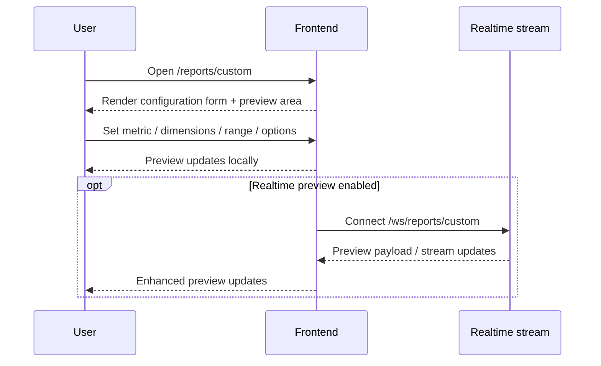
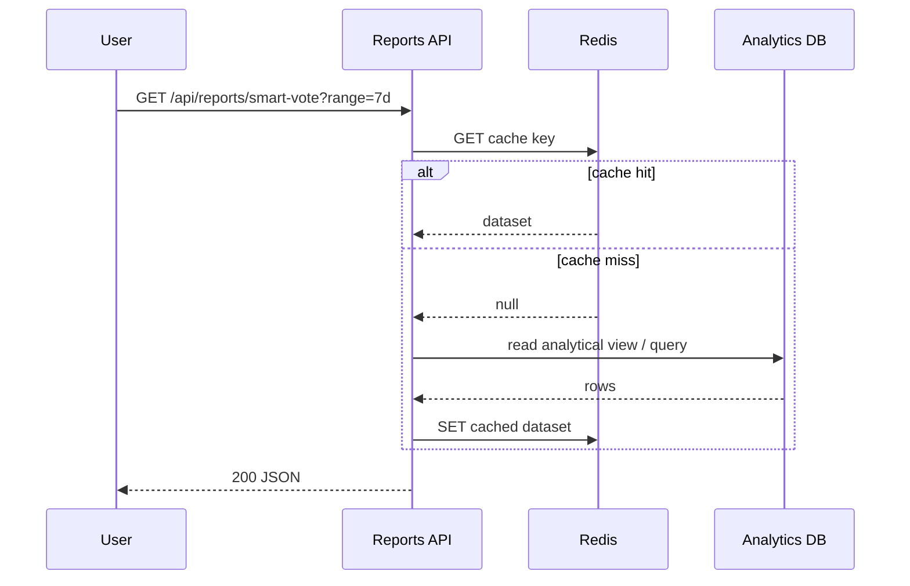

### **Konnaxion v14 – Insights Module UI Spec (Reporting & Analytics Front-end)** *(fully updated, implementation-aligned)*

### ---

## **Document 5.1 – Reporting & Analytics · Frontend layer**

### ---

### **1. Scope**

Describes the currently implemented **frontend slice** of the Konnaxion **Insights / Reporting & Analytics** module.

This document covers the **user-facing React / Next.js App Router pages** that expose read-only analytical views and a beta custom report-building experience under the **`/reports`** namespace.

It includes:

- the Reports landing / hub page
- the Smart Vote dashboard
- the Usage dashboard
- the Performance dashboard
- the beta Custom Report Builder page
- their shared shell, filters, navigation, preview state, and data-access expectations

This document is limited to the **frontend layer**.  
The backend service contract is described in **Document 5.2**, the analytical schema in **Document 5.3**, and infrastructure / operations in **Document 5.4**.

### **Implementation status note**

The Reports frontend is no longer a purely target-state concept.  
The current codebase contains implemented routes and page files for:

- `/reports`
- `/reports/custom`
- `/reports/smart-vote`
- `/reports/usage`
- `/reports/perf`

The current frontend workspace has also passed both:

- `tsc --noEmit`
- `pnpm build`

Accordingly, this document is written as an **implementation-aligned frontend specification**, not as a speculative package design.

### ---

### **2. Routes & Navigation**

| Route | Page | Current role | Consumed API(s) / runtime dependency |
| ----- | ----- | ----- | ----- |
| `/reports` | `ReportsHomePage` | Overview / hub page for Insights surfaces | none required for initial shell |
| `/reports/smart-vote` | `SmartVoteDashboard` | Smart Vote / consensus analytics | `GET /api/reports/smart-vote` |
| `/reports/usage` | `UsageDashboard` | MAU / projects / docs / adoption | `GET /api/reports/usage` |
| `/reports/perf` | `PerfDashboard` | Latency, throughput, error, uptime views | `GET /api/reports/perf` |
| `/reports/custom` | `CustomReportBuilderPage` | Beta builder / preview workflow | current frontend preview, optional `WS /ws/reports/custom` |

### **Navigation rules**

- The **`/reports`** namespace is reserved for the Insights module.
- The frontend uses a shared **`ReportsPageShell`** to provide title, subtitle, actions, and consistent page framing.
- The Reports hub page acts as a **navigation entry point**, not as a replacement for the dedicated dashboards.
- No other module may claim `/reports/*` or `/ws/reports/*` without a formal routing-reference update.

### **Current route ownership**

The Reports / Insights slice remains a **global analytics surface** rather than an Ethikos-only or module-local sub-area. It may visualize data from multiple modules, but its route namespace remains distinct and reserved.

### ---

### **3. Primary UI Surfaces**

| Surface / Component | Current role | Notes |
| ----- | ----- | ----- |
| `ReportsPageShell` | Shared page shell for all Reports pages | Standardized title, subtitle, actions, page framing |
| Reports overview cards | Entry-point KPI / navigation cards on `/reports` | Directs users to dedicated dashboards |
| Time-range controls | Quick-range + absolute date controls | Used where page semantics require filtering |
| Dashboard KPI cards | Large summary metrics | Reused across dashboards |
| Dashboard charts | Visual render of trends, KPIs, and distributions | Charting library remains implementation-defined |
| Report shortcut list | Quick navigation from hub page | Links to Smart Vote / Usage / Perf |
| Builder configuration form | Interactive builder UI on `/reports/custom` | Ant Design Pro form flow |
| Builder preview panel | Live local preview / optional realtime preview | Current implementation is frontend-led / beta |
| Export actions | Optional report export triggers | Governed by backend permissions and export limits |

### **Important correction vs older spec language**

This frontend specification does **not** freeze the Reports slice to a single mandatory charting library.  
The current codebase already uses page-level implementation choices, and the authoritative contract is:

- route ownership
- shell/layout consistency
- data-access contract
- accessibility and testing expectations

not a hard requirement that every dashboard must use one charting package.

### ---

### **4. Shared Layout, Shell, and UX Pattern**

All Reports pages must render inside the shared **Reports page shell**, which provides:

- a page title
- a short descriptive subtitle
- optional primary and secondary actions
- consistent visual spacing and width behavior
- compatibility with the broader platform design system

The shell is the canonical wrapper for this slice and replaces any earlier assumptions that reports pages would live in a separate frontend package or an isolated micro-frontend shell.

### **Shell expectations**

Each Reports page should supply:

- `title`
- `subtitle`
- optional `metaTitle`
- optional action buttons
- page content as children

### **Design constraints**

- no hard-coded visual palette outside approved design tokens
- no bespoke top-level shell invented for one report page
- no inline raw-fetch orchestration in chart components
- all page-level analytics behavior must remain compatible with the global platform layout

### ---

### **5. State & Data Handling**

### **5.1 Current frontend data model**

The current Reports frontend relies on a small number of predictable patterns:

#### **A. Dashboard REST query pattern**
Pages load report data from canonical read-only endpoints under:

- `/api/reports/smart-vote`
- `/api/reports/usage`
- `/api/reports/perf`

These are frontend-consumed as dashboard datasets with KPI summaries and chart-ready structures.

#### **B. Custom builder preview pattern**
The custom builder page manages:

- local form state
- preview configuration state
- preview rendering state

The builder currently behaves as a **beta preview surface**.  
Realtime preview can optionally be connected through:

- `WS /ws/reports/custom`

but the page must still function as a valid frontend experience even when realtime orchestration is not yet fully enabled end-to-end.

### **5.2 Cache expectations**

The Reports frontend may cache request results using a client-side query cache or equivalent wrapper behavior.

Minimum expectations:

- endpoint + params determine cache identity
- cache must invalidate on relevant filter changes
- dashboard views should avoid unnecessary repeat fetches during short user interactions

### **5.3 State-management expectations**

No Redux requirement is imposed for this slice.

The current architecture is satisfied by:

- local component state
- query-hook state
- shell/action props
- optional stream state for builder preview

### **5.4 Data-orchestration rule**

Report components and charts **must not** become orchestration layers for multiple unrelated raw HTTP calls.  
Aggregation and composition belong in a service layer or report-specific data hook.

### ---

### **6. Current Page Definitions**

### **6.1 `/reports` — ReportsHomePage**

Purpose:

- act as the landing page for Insights
- present an overview of the available report families
- expose quick-range or summary context
- route users to the deeper dashboards

Current UX responsibilities:

- display high-level cards / KPI summaries
- present quick links to Smart Vote, Usage, and Performance
- explain how to use the Reports area
- remain readable even before deeper dashboards are opened

This page is a **hub**, not a full analytical substitute for the dedicated report routes.

---

### **6.2 `/reports/smart-vote` — SmartVoteDashboard**

Purpose:

- visualize Smart Vote outcomes, trends, and correlations
- support time-range filtering
- expose read-only analytical views of voting behavior

Expected content:

- KPI summary cards
- time-series trend visuals
- consensus / participation / polarization indicators
- page-level filters where applicable
- optional export / admin-only advanced actions

---

### **6.3 `/reports/usage` — UsageDashboard**

Purpose:

- show adoption and platform usage signals such as:
  - active users
  - projects
  - documents / resources
  - domain-level activity

Expected content:

- module/domain comparisons
- adoption over time
- usage summary cards
- segment or domain breakdowns
- optional export / admin-oriented analytics actions

---

### **6.4 `/reports/perf` — PerfDashboard**

Purpose:

- expose reliability and service-health analytics for the platform

Expected content:

- latency KPIs
- throughput trends
- error-rate series
- uptime / SLO summaries
- endpoint or service-level breakdowns
- operational views relevant to approved audiences

---

### **6.5 `/reports/custom` — CustomReportBuilderPage**

Purpose:

- provide a configurable report composition interface
- let users choose metrics, dimensions, ranges, and options
- preview how a custom analytical view would look

Current status:

- **beta**
- currently frontend-led / preview-oriented
- valid and implemented as a page
- may optionally connect to a realtime builder stream via WebSocket

Important note:

This page should be documented as a **builder / preview surface**, not as proof that full report persistence, scheduling, or saved-query lifecycle is complete.

### ---

### **7. User Flows**

### **7.1 Overview → dashboard flow**

```mermaid
sequenceDiagram
  participant U as User
  participant F as Frontend
  participant API as Reports API

  U->>F: Open /reports
  F-->>U: Render overview / cards / shortcuts
  U->>F: Open specific dashboard
  F->>API: GET /api/reports/<endpoint>
  API-->>F: JSON dataset
  F-->>U: Render charts + KPI cards
````

---

### **7.2 Smart Vote dashboard flow**

```mermaid
sequenceDiagram
  participant U as User
  participant F as Frontend
  participant API as Reports API

  U->>F: Open /reports/smart-vote
  F->>API: GET /api/reports/smart-vote?range=30d
  API-->>F: JSON dataset
  F-->>U: Charts render
  U->>F: Change filter / range
  F->>API: GET updated query
  API-->>F: JSON dataset
  F-->>U: Dashboard refreshes
```

---

### **7.3 Custom builder flow**



### **Flow rule**

Even where realtime is available, the page should degrade gracefully to a non-streaming preview experience.

### ---

### **8. Accessibility, i18n, and UX Quality**

The Reports slice must conform to the platform accessibility baseline.

Minimum expectations:

* charts must not be the only carrier of meaning
* labels and summaries must remain readable without visual decoding alone
* color usage must satisfy WCAG AA expectations
* report pages must remain navigable via keyboard
* all user-facing labels should remain localisable under the Reports / Insights namespace

Recommended pattern:

* pair charts with summaries, legends, tooltips, or compact tabular cues
* avoid visually dense dashboards that collapse on smaller screens
* prefer progressive disclosure over showing every metric at once

### ---

### **9. Tests & Quality Gate**

| Level            | Current expectation                                                   |
| ---------------- | --------------------------------------------------------------------- |
| Unit             | page helpers, formatting helpers, no-data states, component rendering |
| Integration      | query/filter changes and API-state transitions                        |
| Type safety      | `tsc --noEmit` must pass                                              |
| Production build | `pnpm build` must pass                                                |
| Runtime QA       | manual verification of `/reports*` routes after deployment            |
| Contract QA      | route/API assumptions must remain aligned with backend contract docs  |

### **Current quality status**

The current frontend implementation has passed:

* TypeScript validation
* production build validation

Runtime verification is still required after deployment or after any API-contract change.

### ---

### **10. Dependencies (frontend layer)**

* **Next.js App Router**
* **React**
* **Ant Design 5**
* **`@ant-design/pro-components`**
* charting libraries as used by the current page implementation
* frontend service wrappers for `/api/reports/*`
* optional realtime connection to `/ws/reports/custom`

### **Dependency policy**

This document specifies the **contract**, not a mandatory lock-in to one visualization library.
Chart-library choices may evolve so long as:

* route structure stays consistent
* data contracts stay consistent
* accessibility expectations stay satisfied
* shell/layout patterns remain shared

### ---

### **11. Folder Structure (implementation-oriented)**

```text
frontend/
  app/
    reports/
      ReportsPageShell.tsx
      page.tsx
      smart-vote/
        page.tsx
      usage/
        page.tsx
      perf/
        page.tsx
      custom/
        page.tsx
```

Additional service / hook logic may live outside `app/` in shared frontend modules, but route ownership remains with the structure above.

### ---

## **Document 5.2 – Reporting & Analytics · Backend layer**

### ---

### **1. Scope**

Defines the backend service contract for the **read-only Reports / Insights API** used by the frontend dashboards and, where applicable, the custom builder preview flow.

This layer is responsible for:

* validating query params
* enforcing access control
* orchestrating analytical queries
* caching common read paths
* exporting report datasets
* returning JSON datasets suitable for the frontend dashboards

### **Service boundary**

The Reports backend is conceptually a **read-only analytics service**.
It should not own primary OLTP business entities such as Ethikos topics, KeenKonnect projects, or KonnectED resources. It reads and aggregates from analytical or derived sources.

### ---

### **2. Canonical backend endpoints**

Canonical backend HTTP paths:

* `GET /api/reports/smart-vote`
* `GET /api/reports/usage`
* `GET /api/reports/perf`

Optional / evolving channel:

* `WS /ws/reports/custom`

Additional export or builder endpoints may be added later, but the frontend contract above is the minimum current slice.

### **Route invariants**

* `/api/reports/*` is reserved for the Reports backend service contract.
* `/ws/reports/*` is reserved for Reports realtime use.
* These prefixes must not be repurposed by another module without a documentation and routing-reference update.

### ---

### **3. Backend responsibilities**

The Reports backend must:

1. validate request parameters (range, filters, dimensions, export flags)
2. normalize request defaults
3. authorize access to requested report data
4. query analytical sources or materialized views
5. optionally hydrate labels / dimensions from domain-aware reference data
6. cache repeatable hot queries where useful
7. serialize dashboard-friendly JSON
8. enforce export limits and privacy protections

### **Non-responsibilities**

The Reports backend should not become a generic cross-platform write API.
Write ownership stays with the module that owns the original business entity.

### ---

### **4. AuthZ and data access**

Reports endpoints are **read-only**, but not necessarily public.

Expected backend controls include:

* role-based permissions
* privacy-safe aggregation
* restricted export access for larger datasets
* exclusion of sensitive or small-cohort datasets where policy requires it

Where the analytics source is derived from sensitive user activity, the backend must return only approved aggregated shapes.

### ---

### **5. Caching and query execution**

The Reports API may use Redis or equivalent short-lived caching for frequently requested report datasets.

Backend cache expectations:

* cache key derived from endpoint + params
* cache TTL appropriate to report freshness expectations
* hot-path queries should avoid repeated analytical DB load where response reuse is safe
* cache invalidation policy must remain consistent with the parameter reference and ETL freshness model

### ---

### **6. Export behavior**

Exports are permitted only within backend-enforced limits.

Expected backend duties:

* enforce row-count ceiling
* verify user/role authorization for larger exports
* stream or stage files safely
* ensure exported datasets preserve privacy rules and omit prohibited detail

Frontend buttons alone must never be treated as sufficient security.

### ---

### **7. Unit-of-work sequence (Smart Vote report)**



### **Implementation note**

Exact internal query objects, serializers, and cache decorators may change, but the service responsibilities above remain stable.

### ---

### **8. Tests & quality gate**

| Level          | Requirement                                                  |
| -------------- | ------------------------------------------------------------ |
| Unit           | request validation, serializer stability, cache-key behavior |
| Integration    | endpoint query → analytical source → JSON shape              |
| Contract       | stable response shape for frontend consumers                 |
| Perf           | protect hot paths with realistic cache-enabled baselines     |
| Access control | unauthorized access and export-policy tests                  |

### ---

### **9. Dependencies**

* Python 3.12
* Django 4.2
* Django REST Framework
* Redis-compatible cache layer
* PostgreSQL analytical store
* optional WebSocket / Channels layer for custom-builder realtime flows

### ---

## **Document 5.3 – Reporting & Analytics · Database & Storage layer**

### ---

### **1. Scope**

Defines the analytical relational objects that power the Reports / Insights slice.

This layer covers:

* analytical fact tables
* dimensions
* materialized views / derived datasets
* indexes
* retention assumptions
* privacy and access constraints

This storage layer is conceptually separate from OLTP application tables.

### ---

### **2. Analytical model**

The Reports slice is based on a **star-schema style** analytical design.

#### **Typical dimensions**

* `dim_date`
* `dim_domain`
* `dim_endpoint`
* any other approved descriptive dimensions required for reporting

#### **Typical facts**

* `smart_vote_fact`
* `usage_mau_fact`
* `api_perf_fact`

These support the core frontend dashboards:

* Smart Vote
* Usage / adoption
* API performance

### ---

### **3. Materialized / derived datasets**

The frontend dashboards should generally consume data through:

* curated analytical queries
* materialized views
* service-owned derived datasets

rather than raw fact-table joins emitted directly from the browser contract.

This keeps:

* response times predictable
* privacy rules enforceable
* API shapes stable
* report queries maintainable

### ---

### **4. Retention and freshness**

Analytical retention and refresh behavior are governed by the Insights parameter reference.

At minimum, the Reports storage layer must support:

* historical Smart Vote analytics
* medium-term usage history
* shorter-term API performance data
* refreshable derived views for dashboard consumption

### **Freshness model**

Some dashboards are naturally near-real-time, while others are refreshed on ETL or materialization cadence. The frontend must not assume all report datasets are realtime unless the backend contract explicitly says so.

### ---

### **5. Privacy and security rules**

The analytical storage layer must enforce:

* privacy-preserving user identifiers
* minimum cohort thresholds where applicable
* separation between ETL/service privileges and read-only query roles
* auditability of analytical access patterns

The Reports DB must not become an unrestricted replica of raw user activity.

### ---

### **6. Access model**

A read-only analytical role (or equivalent restricted access model) should be used for report-serving workloads.

Principles:

* report-serving accounts read dimensions / approved views
* raw fact access is restricted where policy requires
* export flows remain subject to authorization and auditing

### ---

### **7. Performance expectations**

The database layer should support:

* hot-path report queries at dashboard-friendly latency
* predictable performance on recent time-window lookups
* partition-aware retention and maintenance
* efficient endpoint/time or domain/time filtering

### ---

### **8. Storage-layer alignment rule**

The analytical schema must remain aligned with:

* backend report-service contracts (Document 5.2)
* frontend page/data expectations (Document 5.1)
* parameter and privacy invariants documented elsewhere

### ---

## **Document 5.4 – Reporting & Analytics · DevOps / Infrastructure layer**

### ---

### **1. Objective**

Defines the operational and infrastructure expectations for the Reports / Insights slice.

This includes:

* runtime services
* ETL / Airflow support
* deployment behavior
* environment-variable expectations
* observability
* backups
* alerting
* scaling expectations

Common platform-wide infrastructure is documented elsewhere; this section covers Reports-specific needs.

### ---

### **2. Runtime components**

Typical Reports runtime components include:

* `reports-api`
* ETL / worker process for analytical refresh tasks
* Airflow scheduler / workers for ETL orchestration
* migration or initialization job for report-service deployment
* Redis cache layer
* analytical PostgreSQL store
* optional object storage for exports

### **Scaling note**

The Reports service should scale independently enough to handle dashboard bursts without forcing scaling policy onto unrelated OLTP services.

### ---

### **3. ETL / Airflow**

The Reports slice depends on periodic ETL or refresh jobs for derived analytical datasets.

Typical duties include:

* ingesting or transforming source data
* refreshing materialized analytical views
* pruning expired data per retention policy
* validating freshness and partition health
* supporting export or downstream audit/report operations where required

### **Operational rule**

Frontend pages must not assume ETL freshness beyond what the backend contract and job schedule guarantee.

### ---

### **4. Environment variables and config**

Reports-specific config belongs in the Insights parameter reference and must remain consistent with deployment values.

Typical configuration areas:

* analytical DB connection
* Redis/cache configuration
* export limits
* retention or cleanup controls
* ETL schedules
* stream / WebSocket settings where used
* alert thresholds and observability hooks

### ---

### **5. Observability**

Minimum operational observability for the Reports slice includes:

* structured logs for API requests
* metrics for query latency, error rate, and cache behavior
* health checks for service readiness
* ETL / Airflow job monitoring
* alert rules for report-service degradation

Recommended focus areas:

* high latency on hot report endpoints
* repeated cache misses on common dashboards
* ETL freshness lag
* export failures
* WebSocket or preview stream failures where enabled

### ---

### **6. Backup, restore, and disaster readiness**

Operational policy must cover:

* analytical DB backup schedule
* restore drills
* retention of backup artifacts
* safe handling of staged export files if applicable
* treatment of Redis as ephemeral cache unless explicitly stated otherwise

### ---

### **7. CI / deployment quality gate**

The Reports slice should pass, at minimum:

* service tests
* migration safety checks
* environment-variable validation where applicable
* frontend typecheck/build
* deployment health verification
* ETL / report-job readiness checks where applicable

### **Frontend gate note**

Because the Reports frontend is now implemented, changes affecting `/reports*` should be treated as part of the production quality gate rather than as placeholder documentation-only surfaces.

### ---

### **8. Security and governance**

Reports infrastructure must respect:

* route invariants
* least-privilege access
* privacy-safe analytical exposure
* auditability of sensitive access
* operational separation between ETL privileges and read-only serving privileges

### ---

### **9. Current implementation status note**

This Document 5 set should now be interpreted as follows:

* **5.1 Frontend** → implemented and build-clean
* **5.2 Backend** → canonical report-service contract
* **5.3 Database** → canonical analytical storage contract
* **5.4 DevOps** → canonical operating model for the slice

The frontend section has been updated to reflect the current implemented `/reports*` pages, while the backend, storage, and DevOps sections remain the authoritative contract layers for the broader analytics slice.

### ---

## **End of Document 5 – Reporting & Analytics slice**


